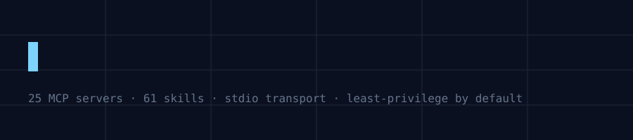
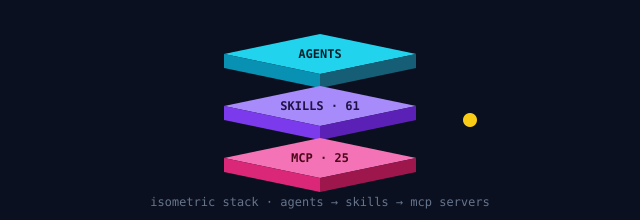
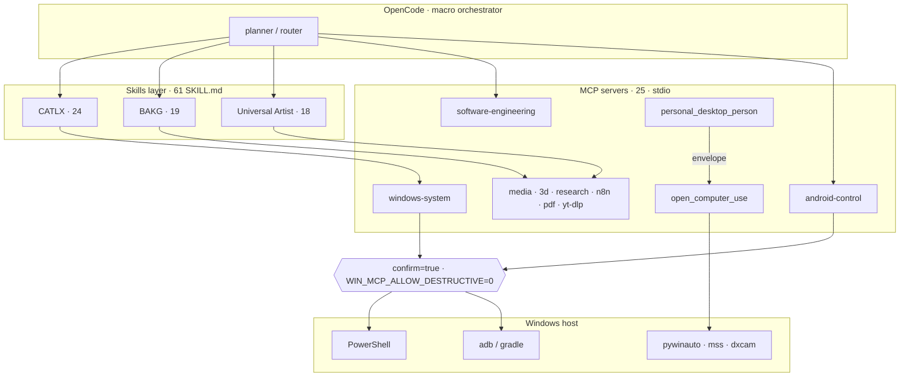
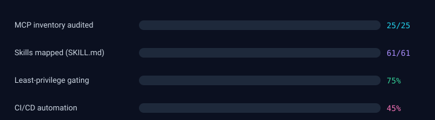

<div align="center">



**25 local MCP servers · 61 `SKILL.md` capabilities · `stdio` transports · Windows-first**

A least-privilege automation substrate for OpenCode: agents reach the desktop, the build system,
the GPU and the network through narrow, gated tool surfaces.


</div>

---

<details>
<summary><b>Contents</b></summary>

- [At a glance](#at-a-glance)
- [What this is](#what-this-is)
- [Install in one command](#install-in-one-command)
- [MCP inventory — 25 servers](#mcp-inventory--25-servers)
- [Skills inventory — 61 SKILL.md](#skills-inventory--61-skillmd)
- [Architecture](#architecture)
- [Security model](#security-model)
- [OpenCode integration](#opencode-integration)
- [Safe architecture](#safe-architecture)
- [Roadmap](#roadmap)
- [Visual kit — 9 animated assets](#visual-kit--9-animated-assets)
- [Contributing](#contributing) · [Licence](#licence) · [Credits](#credits) · [Support](#support)

</details>

---

## At a glance

| | |
| --- | --- |
| **MCP servers** | 25 — 20 Python (`mcp` / `fastmcp`), 3 Node (`@modelcontextprotocol/sdk`), the rest mixed bundles |
| **Transport** | `stdio` everywhere — every server runs as a local sidecar, not an HTTP/SSE endpoint |
| **Skills** | 61 `SKILL.md` files across CATLX (24), BAKG (19), Universal Artist (18) |
| **Host** | Windows 10/11, PowerShell-backed; `pywinauto` + `mss` + `dxcam` for screen and GUI control |
| **Gate** | mutative tools require `confirm=true`; destructive ones also require `WIN_MCP_ALLOW_DESTRUCTIVE=1` |
| **Source** | static, multi-agent audit of `C:\Users\HP\Desktop\New folder` (source: the `ecosystem_audit.md` report this README was built from) |



> **Note on provenance:** this README documents a local bundle audited on a single Windows
> machine. Every inventory number, tool name, and file path below traces back to that audit
> report. If you are adapting this template for your own project, verify each figure against
> your own bundle before publishing — do not assume these counts apply to your setup.

---

## What this is

This repository documents a **local** bundle of Model Context Protocol servers and their skill
ecosystems, and the capability model you need before you let an autonomous agent use it.

The bundle is not published anywhere: it lives on one Windows machine. What is published here is
the audit result — what exists, what each server can actually do, which calls mutate the host, and
where the gates are. Every number in this README traces back to the audit rather than to a guess.

> ⚠️ **Read [Security model](#security-model) before wiring any of this into an agent loop.**
> Unvetted access to `windows_system_mcp` or `se_build` is, in practice, remote code execution.

---

## Install in one command

`bootstrap.py` imports the whole bundle into a machine and leaves it configured: it discovers
every MCP server and `SKILL.md`, installs dependencies, writes the server config, installs the
skills, splits the servers into blast-radius agent profiles, and applies the policies below.

```powershell
# from the folder that holds bootstrap.py, on the Windows machine that holds the bundle
python bootstrap.py --root "C:\Users\HP\Desktop\New folder"
```

That is a **dry run** — it prints the full plan and changes nothing. Then:

```powershell
python bootstrap.py --root "C:\Users\HP\Desktop\New folder" --apply              # install
python bootstrap.py --root "C:\Users\HP\Desktop\New folder" --apply --apply-deps  # + venv/pip/npm
```

| Flag | Effect |
| --- | --- |
| *(default)* | dry run. Prints every action, writes nothing. |
| `--apply` | writes config, skills, profiles, policies, report |
| `--apply-deps` | also runs `python -m venv` + `pip install -e .` and `npm ci` + `npm run build` |
| `--no-skill-patch` | do not insert the policy preamble into `SKILL.md` files |
| `--no-selftest` | skip the per-server import + `--self-test` pass |
| `--opencode`, `--target` | where OpenCode config and the ecosystem live (default `~/.opencode/mcp-ecosystem`) |

**What it writes**

```text
<target>/
  mcpServers.json       every server, stdio, gates in env
  profiles/*.json       default · research · personal · dev · android · desktop-admin
  skills/               every SKILL.md tree, each carrying the policy preamble
  POLICY.md             the gates, the blast-radius rules, what this tool refuses to do
  AGENT_RULES.md        the 8 behavioural rules for any agent that loads these servers
  INSTALL_REPORT.md     inventory, per-server deps + self-test, coverage, errors
```

**What it applies**

The policies are not advisory text — they are written into every server entry and every skill:

| Control | Value | Effect |
| --- | --- | --- |
| `WIN_MCP_ALLOW_DESTRUCTIVE` | `0` | spooler purge, service stop/disable, process kill, adb uninstall, PnP disable are refused |
| `MCP_REQUIRE_CONFIRM` | `1` | a mutative call without `confirm=true` is refused, not queued |
| `MCP_EVIDENCE_REQUIRED` | `1` | no evidence, no success |
| `MCP_SCOPE` | `local` | stdio sidecars only; nothing publishes a port |

Plus `AGENT_RULES.md`: ask before you mutate, never escalate on refusal, one blast radius per
session, close the loop with evidence, envelope don't improvise, destructive is out of scope,
stay in the working directory, log what you touched.

> **There is no flag that enables destructive operations.** The audit's conclusion is that
> `win_services`, `win_processes`, `win_spooler purge` and `android_adb` need a human in the
> loop, and a bootstrap script is not a human. To turn one on you have to edit
> `WIN_MCP_ALLOW_DESTRUCTIVE` yourself, which is the point.

> ⚠️ `--apply-deps` runs `pip` and `npm`, i.e. it executes build scripts from the bundle. That is
> why it is opt-in and why the default is a dry run.

---

## MCP inventory — 25 servers


### Host & desktop control

| Component | Runtime | What it reaches | Risk |
| --- | :--: | --- | :--: |
| `windows-system` | python | services, processes, spooler, printers, event logs, WQL | 🔴 |
| `live computer agent` | python | screen at high FPS (`dxcam`), GUI (`pywinauto`) | 🔴 |
| `PersonalDesktopPerson` | python | desktop actions via envelope → `open_computer_use` | 🔴 |
| `audio-bridge` | python | Bluetooth + audio devices via PowerShell | 🟠 |
| `virtualtion mcp and the skill` | node | VM lifecycle / hypervisor control | 🟠 |

### Media & 3D

| Component | Runtime | What it reaches | Risk |
| --- | :--: | --- | :--: |
| `bakg` | python | Blender animation pipeline (19 skills) | 🟢 |
| `UniversalArtistMCP` | python | stateful design creation | 🟢 |
| `UniversalGraphicsMCP` | python | graphics/asset generation | 🟢 |
| `image-to-3d-character` | python | image → rigged 3D character | 🟢 |
| `media editing mcp and skills` | node | timeline editing, transcode | 🟢 |
| `audio workstation mcp` | python | DAW session control | 🟢 |
| `yt-dlp` | python | downloads via the external `yt-dlp` binary | 🟠 |

### Development & research

| Component | Runtime | What it reaches | Risk |
| --- | :--: | --- | :--: |
| `android-control` | python | `adb`, `gradle`, device list, project scaffolding | 🔴 |
| `opencode new mcps` | python | `software-engineering` (`se_build`, `se_test`, `se_deps`) + others | 🔴 |
| `decompilers mcp sand the skills` | python | binary/bytecode decompilation | 🟠 |
| `hybrid eps mcp and the skill` | python | EPS/print pipeline | 🟢 |
| `n8n package with the mcp and the skills` | node | workflow execution + webhook triggers | 🟠 |
| `universal-pdf-system` | python | PDF parse, merge, extract | 🟢 |
| `universal-research-mcp` | python | web research, read-only | 🟢 |

### Personal automation & orchestration

| Component | Runtime | What it reaches | Risk |
| --- | :--: | --- | :--: |
| `catlx-skill-system` | python | progressive-loading skill DAG (Windows-only) | 🟠 |
| `unified-operator` | python | single fan-out entry point | 🟠 |
| `self-improvement-engine` | python | rewrites its own skill prompts from failures | 🟠 |
| `jarvis-addon` | python | assistant addons | 🟢 |
| `olcap-image-generator` | python | image generation | 🟢 |
| `olcap-phonecall-management` | python | telephony | 🟠 |
| `olcap-realtime-assistant` | python | realtime voice/screen assistant | 🟠 |

<details>
<summary><b>Per-server detail for the three high-risk servers</b></summary>

#### `windows-system` — 6 tools, PowerShell-backed

| tool | effect | gate |
| --- | --- | --- |
| `win_services` | start / stop / disable services | `confirm=true` |
| `win_processes` | inspect / kill processes | `confirm=true` |
| `win_spooler` | list queue, **`purge`** (destructive) | `confirm=true` + env flag |
| `win_printers` | list printers, set default | — |
| `win_event_logs` | read event logs | — |
| `win_cim_query` | arbitrary WQL (read path) | — |

#### `android-control` — 4 tools, spawns subprocesses

| tool | effect | gate |
| --- | --- | --- |
| `android_devices` | `adb devices` listing | — |
| `android_adb` | arbitrary adb arguments | `confirm=true` + device allow-list |
| `android_gradle` | run gradle tasks (installs, signs) | `confirm=true` |
| `android_create_project` | scaffold a project | — |

#### `software-engineering` (inside `opencode new mcps`)

| tool | effect | gate |
| --- | --- | --- |
| `se_build` | invoke npm / cargo / pip build tools | none — scope the cwd |
| `se_test` | run the test runner | none — scope the cwd |
| `se_deps` | add / remove / upgrade dependencies | none — scope the cwd |

</details>

---

## Skills inventory — 61 SKILL.md

<table>
<tr>
<td valign="top" width="33%">

**CATLX** — 24 skills

Progressive-loading AI operating system.
DAG workflow, strictly Windows scope.

</td>
<td valign="top" width="33%">

**BAKG** — 19 skills

Blender animation production:
lookdev, rigging, layout, render.
Driven by `bakg-orchestrator`.

</td>
<td valign="top" width="33%">

**Universal Artist** — 18 skills

Stateful design creation through
structured critique passes.

</td>
</tr>
</table>

Skills are plain `SKILL.md` files: OpenCode discovers them from its `skills/` directory and matches
the tool schemas they declare against whichever MCP servers are currently loaded. A skill whose
required tools are not loaded simply does not match — that is the capability model doing its job.

---

## Architecture



OpenCode is the macro-orchestrator. It reads `SKILL.md`, resolves each step to a tool, and routes
the call over `stdio` to a local sidecar process. Two contracts make the loop closeable:

1. **Envelope.** `personal_desktop_person` never touches the mouse. It emits a typed action
   envelope; OpenCode routes that envelope to `open_computer_use`, which performs the physical
   interaction.
2. **Evidence.** The acting MCP must return cryptographic / stateful proof — screenshot hash,
   window state, exit code — before the plan is marked complete. No evidence, no success.



<details>
<summary><b>What a gated call actually looks like</b></summary>


</details>

---

## Security model

Subprocess and shell execution is the norm in this bundle, not the exception: `audio-bridge`
invokes PowerShell for Bluetooth, `yt-dlp` wraps an external executable, `android-control` spawns
ADB, and the Node servers use `execFileSync` / `spawn`.

| Risk | Where | Mitigation |
| --- | --- | --- |
| Subprocess / shell | `audio-bridge`, `yt-dlp`, `android-control`, Node `spawn` | bounded parameters, `confirm=true` |
| Host mutation | `win_services`, `win_processes`, `win_spooler purge` | `confirm=true` **and** `WIN_MCP_ALLOW_DESTRUCTIVE=0` |
| Hardware / device | `nvidia-smi` polling, PnP device disable | allow-list + explicit confirm |
| GUI takeover | `pywinauto` / `mss` / `dxcam` via `open_computer_use` | envelope + evidence round-trip |
| Build system | `se_build`, `se_test`, `se_deps` | scope the working directory, never grant alongside `windows-system` |

**Do not** hand a single agent both `windows-system-mcp` and `software-engineering-mcp` unless the
task strictly requires it. Group MCPs by blast radius, not by convenience.

---

## OpenCode integration

<details open>
<summary><b>Python MCP — 20 of 25 servers</b></summary>

```json
{
  "mcpServers": {
    "windows-system": {
      "command": "C:\\Users\\HP\\Desktop\\New folder\\opencode new mcps\\windows-system-mcp\\.venv\\Scripts\\python.exe",
      "args": ["-m", "windows_system_mcp"],
      "env": { "WIN_MCP_ALLOW_DESTRUCTIVE": "0" }
    }
  }
}
```

</details>

<details>
<summary><b>Node MCP — 3 of 25 servers</b></summary>

```json
{
  "mcpServers": {
    "virtualization-mcp": {
      "command": "node",
      "args": ["C:\\Users\\HP\\Desktop\\New folder\\virtualtion mcp and the skill\\build\\index.js"]
    }
  }
}
```

</details>

Skills go into OpenCode's `skills/` directory:

```powershell
Copy-Item -Recurse "C:\Users\HP\Desktop\New folder\catlx-skill-system\skills\*" "$env:USERPROFILE\.opencode\skills\"
```

Then a call either runs or refuses — the refusal is the feature:

```text
> win_spooler(action="purge")
✗ refused: destructive action requires confirm=true AND WIN_MCP_ALLOW_DESTRUCTIVE=1

> win_event_logs(source="System", since="1h")
✓ 214 entries (read-only, no gate)
```

---

## Safe architecture

1. **Isolate tool access.** Group MCPs logically. Never load system administration and code
   generation into the same agent profile unless the task demands it.
2. **Enforce state guards.** Keep `confirm=true` in every mutative signature and leave
   `WIN_MCP_ALLOW_DESTRUCTIVE` off by default.
3. **Approval flows.** Wrap PowerShell, subprocess and hardware access in OpenCode's
   request-feedback loop so a human approves OS-level changes.



---

## Roadmap

- [x] Static audit of 25 MCP servers and 61 skills
- [x] Risk classes and default gates documented
- [ ] Per-server tool-schema export (`--dump-tools`) so CI can diff the surface
- [ ] Capability allow-lists per agent profile
- [ ] Human-approval queue inside OpenCode for every PowerShell path
- [ ] Nightly regeneration of every asset in this README

---

## Visual kit — 9 animated assets

Every decoration in this README is a hand-written SMIL-animated SVG living in `assets/svg/`, so
the header, the terminal demo, the icon strip, the isometric diagram, and the progress bars all
render and animate natively on GitHub — no external image host, no JS.

| File | Used as | Animates |
| --- | --- | --- |
| `header-typing.svg` | top banner | clip-reveal title + travelling cursor |
| `terminal-window.svg` | bootstrap demo | four typed lines, then a blinking prompt |
| `animated-icons.svg` | inventory intro | LED blink, spinning gear, drawn checkmark |
| `3d-isometric-stack.svg` | architecture | floating stack + orbiting token |
| `progress-bars.svg` | roadmap | four bars filling to the audit numbers |
| `divider-animated.svg` | footer | dash-draw lines + rotating diamond |
| `separator-wave.svg` | long-section break | two out-of-phase sine paths |
| `header-gradient.svg` | light-mode hero (alternate) | colour-cycling gradient stops |
| `ascii-banner.svg` | terminal-mode hero (alternate) | figlet banner + `OK` flash |

> **Why SMIL and not CSS?** GitHub proxies README images through `camo`, which strips `<script>`,
> external stylesheets and CSS `@keyframes`. SMIL (`<animate>`, `<animateTransform>`) survives, so
> every animation here is written with it — 9 files, ~18 KB total, no build step.


---

## Contributing

1. Open an issue before adding a tool that mutates host state.
2. New MCP server: add a row to the [inventory](#mcp-inventory--25-servers) **and** to the risk
   table in the same PR.
3. New mutative tool: `confirm: bool = False` in the signature, and refuse when it is false.
4. Never commit a secret, a `.venv`, or an absolute path that is not already in this README.

---

## Licence

MIT. Vendor binaries (`blender.exe`, `adb.exe`, `yt-dlp.exe`) and the MCP
protocol name/logo remain under their own licences.

## Credits

- [Model Context Protocol](https://modelcontextprotocol.io) — protocol and Python/TS SDKs
- [OpenCode](https://opencode.ai) — orchestrator and skill discovery
- `pywinauto` · `mss` · `dxcam` — the desktop-perception stack behind `open_computer_use`
- [shields.io](https://shields.io) · [simple-icons](https://simpleicons.org) · [mermaid](https://mermaid.js.org) — every badge and diagram here

## Support

| Channel | Use it for |
| --- | --- |
| [Issues](https://github.com/YOUR_GITHUB_USERNAME/YOUR_REPO/issues) | bugs, missing inventory rows, broken assets |
| [Discussions](https://github.com/YOUR_GITHUB_USERNAME/YOUR_REPO/discussions) | capability-model design, agent profiles |
| [Security advisories](https://github.com/YOUR_GITHUB_USERNAME/YOUR_REPO/security/advisories/new) | anything that bypasses a gate — **do not** open a public issue |

---

<div align="center">


**Built from a static audit of `C:\Users\HP\Desktop\New folder`** · 25 MCP servers · 61 skills

> ⚠️ Every mutative tool ships with `confirm=true` and `WIN_MCP_ALLOW_DESTRUCTIVE=0`.
> Do not grant an autonomous agent `win_services`, `win_processes` or `android_adb`
> without a human in the loop.

</div>
